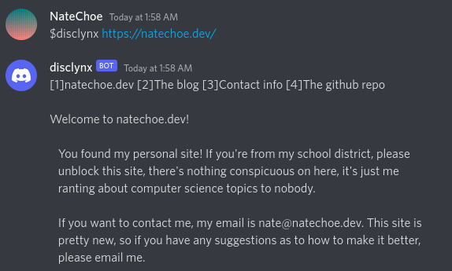

# disclynx: A discord web browser

disclynx is a web browser that is accessible through Discord. It uses the lynx
web browser as a backend, hence the name. Using disclynx is incredibly simple.
Just host an instance of the disclynx bot (there's no way I'm allowing anyone to
create unsolicited web connections from my IP address unless it's for Tor), and
invoke it with

    $disclynx [url]

